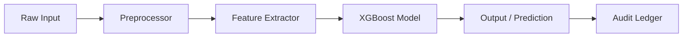

# PROJECT READINESS SOP
### Make Any Project Resume & Interview Ready — Gaurav's Checklist

> **How to use this:** Drop this file into every project folder. Go through each layer in order.  
> A project is resume-ready only when **every checkbox in every layer** is ticked.  
> If a layer fails, fix it before moving to the next. No skipping.

---

## PRE-AUDIT: DECIDE IF THIS PROJECT BELONGS ON YOUR RESUME

Answer these 3 questions first. If any answer is NO — the project either gets fixed or gets dropped.

| Question | Answer |
|---|---|
| Can I explain this project in 60 seconds to a non-technical person? | YES / NO |
| Can I explain every technical decision I made without notes? | YES / NO |
| Is the code running right now on GitHub without errors? | YES / NO |

---

## LAYER 1 — CODE INTEGRITY
> **Goal:** Anyone can clone this and it works. First time. No questions.

### 1.1 Fresh Clone Test
- [ ] Open a terminal with no existing virtual environment
- [ ] `git clone <your-repo>` into a completely new folder
- [ ] Follow ONLY what your README says — nothing else
- [ ] The project runs successfully
- [ ] No "ModuleNotFoundError", no missing env vars, no hardcoded paths like `/home/gaurav/...`

### 1.2 Dependency File Audit
- [ ] `requirements.txt` or `pyproject.toml` exists (Python)
- [ ] `package.json` exists with all deps listed (Node/JS)
- [ ] Versions are pinned — `fastapi==0.110.0` not just `fastapi`
- [ ] No dependency that only exists on your local machine
- [ ] Run `pip install -r requirements.txt` fresh and confirm zero errors

### 1.3 Code Hygiene
- [ ] No commented-out blocks of dead code visible
- [ ] No `print("debug")` or `console.log("test123")` statements
- [ ] No hardcoded absolute paths (`/Users/gaurav/Desktop/data.csv`)
- [ ] No hardcoded benchmark numbers that aren't generated by actual code
- [ ] No `TODO` or `FIXME` in code that's visible in main files
- [ ] No unused imports at the top of files

### 1.4 Secrets & Security
- [ ] `.env.example` file exists showing what env vars are needed
- [ ] Actual `.env` is in `.gitignore`
- [ ] Zero API keys committed anywhere in git history
  - Run: `git log --all --full-history -- "**/*.env"` to verify
  - If keys were ever committed: rotate them immediately, then use `git-filter-repo` to purge
- [ ] No passwords, tokens, or credentials hardcoded anywhere

### 1.5 Git History
- [ ] Commits have meaningful messages — `"Add heteroscedastic loss function for Tobit MLE"` not `"fix"` or `"asdfgh"`
- [ ] At least 10+ commits showing real development progress
- [ ] No single massive commit with 50 files (looks like you dumped it all at once)
- [ ] Branch structure is clean — no dangling `test-branch-2-final-v3` branches

---

## LAYER 2 — GITHUB README
> **Goal:** A recruiter who knows nothing about your project understands what it does, why it matters, and how good it is — in under 90 seconds.

### 2.1 Header Section
```markdown
# Project Name

One sentence: what does this do and why does it matter?

[]()
[]()
[]()
```
- [ ] Project name is clear and specific (not "ML-Project-2" or "Hackathon")
- [ ] One-line description answers: **what problem does this solve?**
- [ ] Badges are real — test every badge URL before pushing
- [ ] No fabricated Simple Icons slugs (verify slug at simpleicons.org)

### 2.2 Demo / Screenshot Section (CRITICAL)
- [ ] GIF or screenshot appears **within the first scroll** — not buried at the bottom
- [ ] If it's an ML model: show input → output example with real data
- [ ] If it's an API: show a real curl/Postman request and the actual response
- [ ] If it's a system: show architecture diagram PLUS a demo
- [ ] Demo GIF is under 5MB (use `gifsicle` to compress if needed)

### 2.3 Architecture Section
```
Must include one of:
├── Mermaid diagram (renders natively on GitHub)
├── ASCII diagram (zero dependencies, always works)
└── PNG/SVG diagram exported from draw.io or excalidraw.com
```
- [ ] Shows all major components
- [ ] Shows data flow — where data enters, how it moves, where it exits
- [ ] Shows external dependencies (APIs, DBs, models used)
- [ ] Labels every arrow — don't make the reader guess what connects to what

**Mermaid example for a pipeline:**


### 2.4 Benchmark / Results Section (MOST IMPORTANT FOR ML PROJECTS)
- [ ] Every metric has: **what it measures**, **what dataset**, **what baseline you compared against**
- [ ] Format it as a table:

```markdown
| Metric | Your Model | Baseline | Dataset |
|---|---|---|---|
| NDCG@10 | 0.3378 | 0.2891 (ALS) | MovieLens 1M |
| Latency (p99) | 8.3µs | 45µs (naive) | 10k request benchmark |
```

- [ ] Numbers match what your code actually outputs when run
- [ ] You can explain HOW you measured each number (what script, what data split)
- [ ] No metric that exists only in your README but not in your codebase

### 2.5 Setup & Installation Section
```markdown
## Setup

# 1. Clone
git clone https://github.com/yourusername/repo.git
cd repo

# 2. Install
pip install -r requirements.txt

# 3. Configure
cp .env.example .env
# Fill in your values in .env

# 4. Run
python main.py
```
- [ ] Instructions are copy-pasteable — test them yourself on a clean machine
- [ ] Every step is numbered
- [ ] Prerequisites are stated upfront (Python 3.10+, CUDA 11.8, etc.)
- [ ] Common errors are listed with fixes (shows you've thought it through)

### 2.6 Technical Depth Section
This is what separates you from CRUD project people. Include:
- [ ] **Why you chose this approach** over alternatives
- [ ] **What didn't work** and what you learned (shows real engineering)
- [ ] **Known limitations** — shows honesty and maturity
- [ ] **What you'd improve next** — shows forward thinking

### 2.7 Final README Checks
- [ ] Every link in the README actually works (click every one)
- [ ] No broken image URLs
- [ ] Spelling is correct (use Grammarly or VS Code spell check)
- [ ] Markdown renders correctly — preview it on GitHub before finalizing

---

## LAYER 3 — THE 6-QUESTION INTERVIEW STRESS TEST
> **Goal:** You can answer all 6 questions out loud, without notes, for 3 minutes each.  
> Do this with a friend, or record yourself on your phone and watch it back.

For each project on your resume, answer these out loud:

### Q1 — The Problem
*"What exact problem were you solving and why does it matter in the real world?"*
- [ ] Answer is specific — not "I wanted to learn ML"
- [ ] You can name a real user who would benefit
- [ ] You can quantify the problem size (how big is this market/pain)

### Q2 — The Hardest Decision
*"What was the single hardest technical decision you made and why did you make it that way?"*
- [ ] You name ONE specific decision (not a list)
- [ ] You explain what the alternatives were
- [ ] You explain why you rejected the alternatives
- [ ] You explain what tradeoffs your choice introduced

### Q3 — What Failed
*"What did you try that didn't work and what did you learn from it?"*
- [ ] You have a real failure — not "everything went smoothly"
- [ ] You explain what the failure taught you technically
- [ ] You don't sound defensive about it

### Q4 — What You'd Do Differently
*"If you started this project today from scratch, what would you do completely differently?"*
- [ ] Answer is technical and specific
- [ ] Shows growth — you learned something since you built it
- [ ] Not "nothing, it's perfect"

### Q5 — The Weakest Part
*"What is the weakest or most brittle part of your current implementation?"*
- [ ] You have a real honest answer
- [ ] You know WHY it's weak
- [ ] Bonus: you have a plan to fix it

### Q6 — Scale
*"How does this system behave at 10x current load? What breaks first?"*
- [ ] You can name the specific bottleneck
- [ ] You know whether it's compute, memory, I/O, or latency
- [ ] You know what you'd change to fix it

**Scoring:**
- 6/6 fluent answers → project is on your resume, front and center
- 4-5 answers → project goes on resume but you study the gaps before interviews
- Under 4 → project comes off resume until you can answer all 6

---

## LAYER 4 — DEMO READINESS
> **Goal:** You can show the project working live in under 2 minutes with zero setup friction.

### 4.1 Live Demo Setup
- [ ] Project runs on your laptop right now — no "let me set it up first"
- [ ] Demo script is prepared: you know exactly what you'll type/click and in what order
- [ ] Demo takes under 2 minutes from start to result
- [ ] You've rehearsed the demo at least 5 times

### 4.2 Failure Handling
- [ ] You have a **pre-recorded screen recording** as backup (record with OBS or Loom)
- [ ] You have **screenshots of key outputs** as last resort
- [ ] Demo doesn't depend on external APIs that might be down
- [ ] If it needs internet: you've tested it on mobile hotspot, not just your home WiFi

### 4.3 Edge Case Handling
- [ ] Demo doesn't crash on empty input
- [ ] Demo doesn't crash on unexpected characters or long strings
- [ ] You've tested the exact demo flow with wrong inputs to see what happens
- [ ] Error messages are meaningful — not stack traces visible to the interviewer

### 4.4 For ML Projects Specifically
- [ ] You have 3 pre-chosen input examples that showcase the model well
- [ ] You know what the model gets wrong and can explain why (shows depth)
- [ ] If inference is slow: you have pre-computed outputs ready to show instantly
- [ ] You can show training loss curves or evaluation metrics on demand

---

## LAYER 5 — RESUME BULLET QUALITY
> **Goal:** Every bullet is specific, numbered, and impossible to fake.

### 5.1 The Formula
Every bullet = `[Strong verb] + [What you built] + [How / key tech] + [Measurable result]`

### 5.2 Strong Verb Bank
Use these. Never use "worked on", "helped", "assisted", "was involved in":
```
Built | Designed | Implemented | Engineered | Developed | Optimized
Reduced | Improved | Achieved | Deployed | Integrated | Benchmarked
Replaced | Eliminated | Accelerated | Parallelized | Fine-tuned
```

### 5.3 Bullet Examples

**BAD:**
> Built a recommendation system using collaborative filtering techniques

**GOOD:**
> Implemented SVD collaborative filtering on MovieLens 1M (100K users, 1M ratings) achieving NDCG@10 = 0.3378, outperforming ALS baseline by 16.8%

---

**BAD:**
> Created a GPU optimization project using Triton

**GOOD:**
> Engineered Triton GPU kernels for RMSNorm achieving 4.47× throughput over PyTorch baseline on T4 GPU, validated via `triton.testing.Benchmark` across [256, 4096] hidden dimensions

---

**BAD:**
> Built a security system for LLM agents

**GOOD:**
> Built AST-level security validator for LLM agent outputs achieving 100% exploit deflection on OWASP LLM Top-10 attack suite with sub-10µs validation latency

### 5.4 Bullet Checklist
- [ ] Every bullet has at least one number
- [ ] Every number is real and traceable to actual output
- [ ] No passive voice anywhere
- [ ] No vague adjectives: "scalable", "efficient", "robust", "powerful" — prove it with numbers or cut it
- [ ] Bullets are 1-2 lines max — not paragraph-length
- [ ] Tech stack is mentioned but not the entire focus — outcomes matter more

---

## LAYER 6 — CREDIBILITY AUDIT
> **Goal:** Zero inconsistencies between your resume, README, portfolio, and live demo.

### 6.1 The Consistency Triangle
Every metric must match across all three:
```
Resume bullet ←→ GitHub README ←→ Actual code output
```
- [ ] Pick 3 metrics from your resume — run the code and get those numbers right now
- [ ] Numbers match within ±1% (small variation from randomness is okay, major gaps are not)
- [ ] If they don't match: update the code output, then update resume and README together

### 6.2 Technology Claims
For every technology listed on your resume or README:
- [ ] You can write a basic implementation from scratch in 15 minutes
- [ ] You can explain why you chose it over the closest alternative
- [ ] You can name one real limitation of that technology
- [ ] You've used it for more than 1 day total

### 6.3 Portfolio Website Audit
- [ ] Open DevTools → Network tab → Reload — zero 404 errors
- [ ] Every project link opens a real GitHub repo
- [ ] Every "Live Demo" link actually works
- [ ] All icons and images load (check Simple Icons slugs at simpleicons.org)
- [ ] Metrics on portfolio match metrics on resume match metrics on GitHub
- [ ] No fake CI/CD status badges or activity graphs unless they're real
- [ ] No "Coming Soon" sections that have been there more than 2 weeks

### 6.4 GitHub Profile Audit
- [ ] Profile README exists and is up to date
- [ ] Pinned repos are your 4-6 best projects, not the most recent ones
- [ ] Each pinned repo has a description filled in (not blank)
- [ ] Contribution graph shows real activity (green squares)
- [ ] No empty repositories that are just "Project initialized"

---

## LAYER 7 — TARGETING CHECK
> **Goal:** You're showing the RIGHT projects to the RIGHT companies.

### 7.1 Role-to-Project Mapping

| Target Role / Company | Lead With | Supporting |
|---|---|---|
| FAANG ML Engineer | NeuroScope, TritonForge | HyperFlow |
| FAANG SWE | HyperFlow, AgentSentry | CineNexuz |
| DRDO / ISRO | SENTINEL, Aether | RailMind |
| Indian Fintech (Razorpay, CRED) | HyperFlow, AgentSentry | CineNexuz |
| Indian Product-Tech (Swiggy, Zepto) | RailMind, HyperFlow | CineNexuz |
| Research / PhD Application | NeuroScope, TritonForge | SENTINEL |

### 7.2 Per-Application Check
Before submitting any application:
- [ ] Does the JD mention any tech that matches your projects?
- [ ] Is there a direct line from your project to what the company builds?
- [ ] Have you customized the resume order so the most relevant project is first?
- [ ] Have you removed projects that are irrelevant noise for this specific role?

---

## LAYER 8 — ONGOING MAINTENANCE
> **Goal:** Projects don't rot. They stay live, accurate, and demo-ready.

### Monthly Checks
- [ ] Dependency audit — any security vulnerabilities? Run `pip audit` or `npm audit`
- [ ] Are all links still working?
- [ ] Has anything broken due to API changes?
- [ ] Did you ship any improvements worth updating the README for?

### Before Every Application Season
- [ ] Re-run the fresh clone test
- [ ] Re-verify all metrics by re-running the code
- [ ] Update the "What I'd do next" section with what you've actually learned since

### After Every Interview
- [ ] Write down every technical question you couldn't answer confidently
- [ ] Go fix or learn that gap before the next interview
- [ ] If the same gap came up twice: add it to your README as a known limitation (shows honesty)

---

## QUICK REFERENCE — PROJECT STATUS TRACKER

Use this table to track your projects:

| Project | L1 Code | L2 README | L3 Interview | L4 Demo | L5 Bullets | L6 Credibility | Resume Ready? |
|---|---|---|---|---|---|---|---|
| HyperFlow | ✅ | ✅ | ✅ | ✅ | ✅ | ✅ | ✅ |
| TritonForge | ⬜ | ⬜ | ⬜ | ⬜ | ⬜ | ⬜ | ❌ |
| NeuroScope | ⬜ | ⬜ | ⬜ | ⬜ | ⬜ | ⬜ | ❌ |
| AgentSentry | ⬜ | ⬜ | ⬜ | ⬜ | ⬜ | ⬜ | ❌ |
| RailMind | ⬜ | ⬜ | ⬜ | ⬜ | ⬜ | ⬜ | ❌ |
| SENTINEL | ⬜ | ⬜ | ⬜ | ⬜ | ⬜ | ⬜ | ❌ |
| CineNexuz | ⬜ | ⬜ | ⬜ | ⬜ | ⬜ | ⬜ | ❌ |
| Aether | ⬜ | ⬜ | ⬜ | ⬜ | ⬜ | ⬜ | ❌ |

**Legend:** ✅ = Done | 🔄 = In Progress | ❌ = Not Started | ⬜ = Not Checked Yet

---

## THE BRUTAL FINAL FILTER

Before adding ANY project to your resume, answer these 5 questions. All must be YES:

1. **Can I clone this right now on a fresh machine and run it?**
2. **Can I answer all 6 interview questions without hesitation?**
3. **Does my README have a real architecture diagram and real benchmarks?**
4. **Are all metrics consistent across resume, README, and actual code output?**
5. **Can I demo this live in under 2 minutes without it crashing?**

If any answer is NO — the project is off the resume until it passes.

---

*Last updated: July 2026 | Gaurav — DEBUG THUGS*
